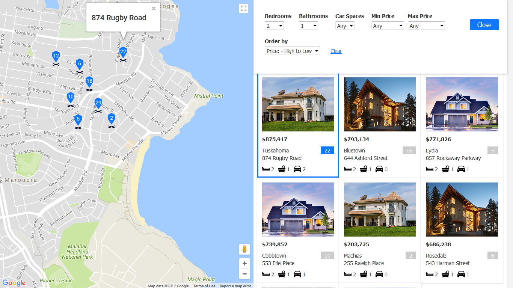

# Property Listings With Google Maps And React

In this project, we build a property listings app using Google Maps API and ReactJS.

This app is made up of App component as the parent component housing children components - Header, Card and Filter. Initialy, the app shows a list of property listings loaded from data file in JSON. Left side of screen shows the markers and info windows of properties on the map. The right side of screen has two parts. The top part is a Header component that give option to toggle filter and Filter component will slide down when turn on. The bottom part is Card component the list of details of properties in card form.

The Google Map is interactive in the sense that you can close the info window if you want to see more of any markers hidden behind the info window. When you select a marker, the Card component will scroll in view to show the selected property. Likewise, when you click any card from Card component, info window will pop up to denote the selected property at its location.

The fun part of this project is you are given options to filter property listings. These options are:
- Number of bedrooms
- Number of bathrooms
- Number of car spaces
- Minimum price
- Maximum price
- Order by: Low -> High / High -> Low

These options can be combined to filter down the list. A clear-all-filter button is available to set everything back to original state. Close button and Filter button are there if you want to show or hide filter panel without losing states.

[View demo site here.](https://edwinchen85.github.io/react_property_listings_app/)

